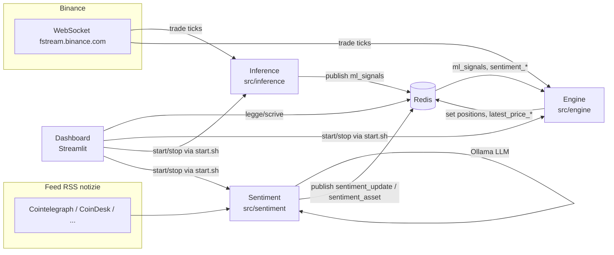

# Hermes HFT

Bot di trading algoritmico per criptovalute (Bitcoin, Ethereum, Solana) su Binance Futures, con generazione di segnali via modello ML (XGBoost), analisi del sentiment delle news tramite LLM locale (Ollama) e una dashboard web per il monitoraggio e il controllo del sistema.

> ⚠️ **Disclaimer**: questo software esegue operazioni di trading reali con leva finanziaria. È un progetto personale in fase di stabilizzazione: usalo a tuo rischio, con capitale che puoi permetterti di perdere, e testa sempre le modifiche prima di lasciarle in esecuzione senza supervisione.

## Indice

- [Panoramica](#panoramica)
- [Architettura generale](#architettura-generale)
- [Requisiti di sistema](#requisiti-di-sistema)
- [Guida rapida all'installazione](#guida-rapida-allinstallazione)
- [Configurazione](#configurazione)
- [Avvio del sistema](#avvio-del-sistema)
- [Avvio della dashboard](#avvio-della-dashboard)
- [Comandi utili](#comandi-utili)
- [Sviluppo e contributi](#sviluppo-e-contributi)
- [Licenza](#licenza)

## Panoramica

Hermes HFT è composto da **3 processi asincroni indipendenti**, scritti in Python con `asyncio`, che non si chiamano mai direttamente tra loro: comunicano esclusivamente tramite **Redis** (chiavi chiave-valore per lo stato condiviso, canali pub/sub per gli eventi). A questi si affianca una **dashboard Streamlit** per il monitoraggio e il controllo operativo.

| Processo | Ruolo |
|---|---|
| **Engine** (`src/engine`) | Riceve i segnali, apre/chiude le posizioni, gestisce stop loss/take profit (anche dinamici via ATR), il reverse trading e le notifiche. |
| **Inference** (`src/inference`) | Si collega al WebSocket di Binance, calcola le feature tecniche e genera segnali `buy`/`sell` con un modello XGBoost. |
| **Sentiment** (`src/sentiment`) | Recupera news da feed RSS e le fa analizzare da un LLM locale (Ollama) per produrre uno score di sentiment per asset. |
| **Dashboard** (`dashboard/`) | Interfaccia Streamlit multipagina per monitorare posizioni/prezzi/log e controllare i processi. |

Funzionalità principali:

- Segnali ML pesati con il sentiment delle news per asset.
- Stop loss / take profit dinamici basati su ATR, con trailing stop.
- Reverse trading automatico su segnale opposto a una posizione aperta.
- Conferma dei segnali tramite analisi di volumi e pattern candlestick.
- Notifiche Telegram ed email su apertura/chiusura posizioni ed errori critici.
- Dashboard web per configurazione a caldo, avvio/arresto processi e reset di emergenza.

Per i dettagli sui singoli moduli vedi [docs/ARCHITECTURE.md](docs/ARCHITECTURE.md); per la dashboard vedi [docs/DASHBOARD.md](docs/DASHBOARD.md).

## Architettura generale



Engine, Inference e Sentiment sono processi Python indipendenti (avviabili anche su terminali separati) che si scambiano dati solo tramite Redis: nessuna chiamata diretta tra i tre. Questo disaccoppiamento permette di riavviare o aggiornare un singolo componente senza fermare gli altri. Approfondimento completo, incluso l'elenco delle chiavi Redis, in [docs/ARCHITECTURE.md](docs/ARCHITECTURE.md).

## Requisiti di sistema

- **Python 3.12+**
- **Redis** (server locale, es. `redis-server` su `localhost:6379`)
- **WSL2** (se si sviluppa/esegue su Windows — il progetto è pensato per un ambiente Linux)
- **Ollama** in esecuzione localmente (`http://localhost:11434` di default) con un modello scaricato per il servizio di sentiment (es. `qwen2.5-coder:1.5b`)
- Le dipendenze Python elencate in [requirements.txt](requirements.txt) (tra le principali: `ccxt`, `websockets`, `xgboost`, `redis`, `streamlit`, `pandas`, `pydantic`, `loguru`)

## Guida rapida all'installazione

```bash
# 1. Clona il repository
git clone https://github.com/ArionArmir/hermes_hst.git ~/hermes_hft
cd ~/hermes_hft

# 2. Crea e attiva il virtual environment
python3 -m venv venv
source venv/bin/activate

# 3. Installa le dipendenze
pip install -r requirements.txt

# 4. Avvia Redis (se non già in esecuzione)
sudo service redis-server start

# 5. Avvia Ollama e scarica il modello usato dal servizio sentiment
ollama serve &
ollama pull qwen2.5-coder:1.5b

# 6. Configura le variabili d'ambiente (notifiche Telegram/Email, opzionali)
cp .env.example .env   # se presente, altrimenti crea .env manualmente — vedi sezione Configurazione
nano .env

# 7. Avvia i tre processi (in terminali separati) e la dashboard
./start.sh engine
./start.sh inference
./start.sh sentiment
streamlit run dashboard/app.py
```

A questo punto la dashboard è raggiungibile su `http://localhost:8501`.

## Configurazione

Hermes HFT usa due livelli di configurazione:

### 1. `.env` — segreti e credenziali

File nella root del progetto (non committato, vedi `.gitignore`), letto da `src/shared/notifier.py` e da `start.sh`. Variabili supportate:

| Variabile | Descrizione |
|---|---|
| `TELEGRAM_TOKEN` | Token del bot Telegram per le notifiche |
| `TELEGRAM_CHAT_ID` | Chat ID a cui inviare le notifiche |
| `EMAIL_ENABLED` | `true`/`false` — abilita le notifiche via email |
| `EMAIL_SENDER` | Indirizzo email mittente |
| `EMAIL_PASSWORD` | Password/app-password SMTP |
| `EMAIL_RECIPIENT` | Indirizzo email destinatario |
| `SMTP_SERVER` | Host SMTP (default `smtp.gmail.com`) |
| `SMTP_PORT` | Porta SMTP (default `587`) |
| `OLLAMA_HOST` | URL del server Ollama (default `http://localhost:11434`) |

### 2. `config/trading_params.yaml` — parametri di trading

Caricato dall'Engine all'avvio e salvato su Redis (chiave `trading_config`); dopo il primo avvio, **Redis è la fonte di verità** e la dashboard (pagina Configurazione) scrive sia su Redis sia su questo file. Esempio:

```yaml
leverage: 3
stop_loss_pct: 0.05
take_profit_pct: 0.04
max_position_size_usdt: 50.0
trailing_stop_pct: 0.015
max_exposure: 0.5
min_volatility_threshold: 0.001
max_volatility_threshold: 0.02
volatility_adjustment: true
symbols:
  - BTCUSDT
  - ETHUSDT
  - SOLUSDT
timeframe: 1h
ml_confidence_threshold: 0.55
sentiment_weight: 0.3
```

L'elenco completo dei parametri (incluse le funzionalità booleane `reverse_trading_enabled`, `pattern_confirmation_enabled`, `dynamic_exit_enabled`, validate tramite il modello Pydantic `Config`) è descritto in [docs/ARCHITECTURE.md](docs/ARCHITECTURE.md#configurazione-e-parametri).

Un aggiornamento della configurazione (da dashboard o manuale su Redis) va notificato pubblicando `1` sul canale Redis `config_updated`: l'Engine è in ascolto e ricarica automaticamente.

## Avvio del sistema

Ogni processo si avvia con lo script `start.sh`, che carica `.env`, verifica che Redis sia attivo, termina eventuali istanze residue dello stesso modulo e avvia il processo richiesto:

```bash
./start.sh engine      # avvia src/engine/main.py (pinnato sulle CPU 0,1 con taskset)
./start.sh inference   # avvia src/inference/main.py
./start.sh sentiment   # avvia src/sentiment/ollama_client.py
```

I tre comandi vanno lanciati in terminali (o sessioni `tmux`/`screen`) separati, poiché ognuno resta in foreground. I log vengono scritti in `logs/` con rotazione giornaliera (`trading_YYYY-MM-DD.log`, `inference_YYYY-MM-DD.log`, `sentiment_YYYY-MM-DD.log`).

In alternativa, i processi possono essere avviati/fermati direttamente dalla pagina **Controllo** della dashboard (vedi sotto).

## Avvio della dashboard

```bash
streamlit run dashboard/app.py
```

La dashboard si avvia in ascolto solo su `localhost` (vedi `dashboard/.streamlit/config.toml`) — **volutamente non esposta su `0.0.0.0`**, perché permette di modificare la configurazione di trading e di chiudere posizioni. È raggiungibile su `http://localhost:8501` ed è organizzata in 4 pagine: Dashboard (Home), Configurazione, Controllo, Log. Guida completa in [docs/DASHBOARD.md](docs/DASHBOARD.md).

## Comandi utili

| Comando | Descrizione |
|---|---|
| `./start.sh engine` \| `inference` \| `sentiment` | Avvia il processo indicato (termina istanze residue) |
| `streamlit run dashboard/app.py` | Avvia la dashboard web |
| `pytest` | Esegue la suite di test |
| `redis-cli monitor` | Osserva in tempo reale i comandi Redis (debug) |
| `redis-cli get positions` | Ispeziona le posizioni aperte correnti |
| `redis-cli publish config_updated 1` | Forza il reload della configurazione sull'Engine |
| `tail -f logs/trading_$(date +%F).log` | Segue in tempo reale il log dell'Engine |
| `python optimize_models.py` | Ottimizza/ri-allena i modelli (vedi `src/training/`) |

Ulteriori comandi di sviluppo e debug in [docs/DEVELOPMENT.md](docs/DEVELOPMENT.md).

## Sviluppo e contributi

- Segui lo stile PEP8 e usa `loguru` per il logging (non `print`).
- Aggiungi test in `tests/` per la logica di trading critica (SL/TP, apertura posizioni) prima di aprire una pull request.
- Esegui `pytest` localmente prima di ogni commit.
- Descrivi nel messaggio di commit *perché* è stata fatta una modifica, non solo *cosa* cambia.

Guida completa all'ambiente di sviluppo, struttura delle cartelle e convenzioni in [docs/DEVELOPMENT.md](docs/DEVELOPMENT.md).

## Licenza

Il progetto non ha ancora una licenza open source definita: allo stato attuale è da considerarsi **proprietario / uso privato**. Se l'intenzione è distribuirlo pubblicamente, aggiungi un file `LICENSE` (es. MIT, Apache 2.0) nella root del repository.
