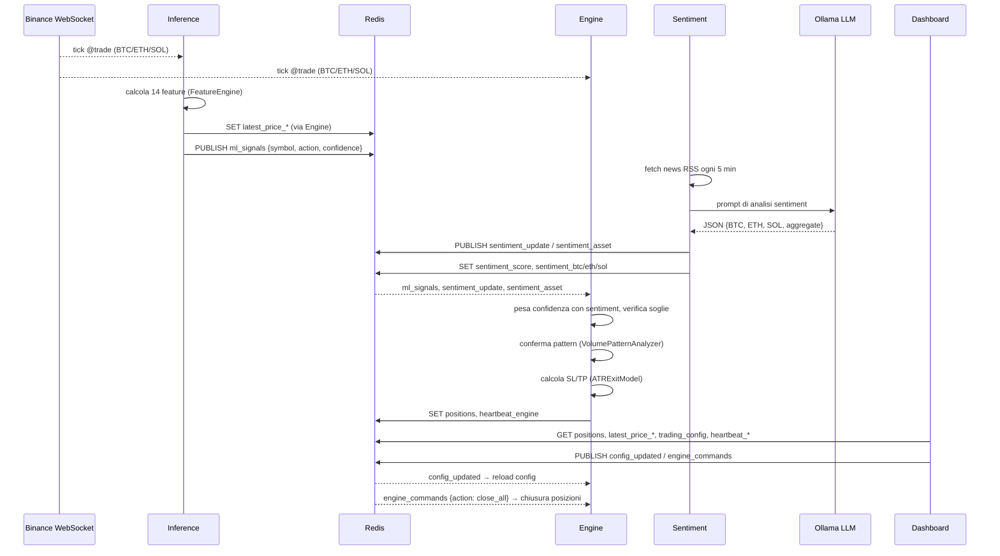

# Architettura

Questo documento descrive in dettaglio i moduli di Hermes HFT, come i dati fluiscono tra i tre processi tramite Redis, e il significato di ogni parametro di configurazione. Per la guida rapida all'avvio vedi il [README](../README.md).

## Indice

- [Moduli principali](#moduli-principali)
- [Flusso dei dati](#flusso-dei-dati)
- [Dettaglio Redis](#dettaglio-redis)
- [Configurazione e parametri](#configurazione-e-parametri)

## Moduli principali

### `src/core/` — modelli dati

Definisce i tre modelli Pydantic condivisi da tutto il sistema (`src/core/models.py`), usati sia per la validazione sia per la (de)serializzazione JSON via Redis:

- **`Position`**: una posizione aperta/chiusa (`symbol`, `side`, `entry_price`, `quantity`, `leverage`, `stop_loss`, `take_profit`, `trailing_stop`, `entry_time`, `pnl`, `is_open`).
- **`Signal`**: un segnale di trading (`symbol`, `action` — `buy`/`sell`/`hold`/`close`, `confidence` 0-1, `timestamp`, `source` — `ml`/`sentiment`).
- **`Config`**: tutti i parametri di trading (vedi [Configurazione e parametri](#configurazione-e-parametri)), validati con Pydantic prima di essere applicati o salvati.

### `src/engine/` — Trading Engine

`src/engine/main.py` contiene la classe `TradingEngine`, il cuore del sistema:

- Si connette al WebSocket combinato di Binance Futures (`wss://fstream.binance.com/stream`) per i tick `@trade` di BTC, ETH, SOL.
- Mantiene in memoria posizioni aperte, ultimi prezzi, sentiment aggregato e per-asset.
- Gestisce **stop loss / take profit dinamici** tramite `ATRExitModel` (uno per simbolo) quando `dynamic_exit_enabled` è attivo, altrimenti usa le percentuali statiche di configurazione.
- Aggiorna un **trailing stop** ad ogni tick se il prezzo si muove a favore della posizione.
- Applica il **reverse trading**: se arriva un segnale opposto a una posizione aperta, la chiude prima di eventualmente aprirne una nuova.
- Filtra i segnali ML pesandoli con il sentiment per asset (`sentiment_weight`) e li scarta se sotto `ml_confidence_threshold`, oppure se il sentiment è fortemente negativo su un segnale `buy`.
- Se `pattern_confirmation_enabled` è attivo, chiede conferma a `VolumePatternAnalyzer` prima di aprire una posizione: un segnale `REJECT` blocca l'apertura.
- Scrive un heartbeat su Redis (`heartbeat_engine`) ogni 5 secondi tramite `_position_monitor`.
- Ascolta i canali Redis `ml_signals`, `sentiment_update`, `sentiment_asset`, `config_updated`, `engine_commands` (vedi [Dettaglio Redis](#dettaglio-redis)).
- Invia notifiche Telegram/email tramite `src/shared/notifier.py` su apertura/chiusura posizione.
- Registra ogni trade chiuso su `data/trades_history.csv` (usato dalla dashboard per KPI ed equity curve).
- **Nota**: il posizionamento ordini (`_place_limit_order`, `_place_close_order`) è attualmente uno stub che logga soltanto — non invia ordini reali a un exchange.

### `src/inference/` — ML Inference

`src/inference/main.py` (classe `MLInference`) genera i segnali di trading:

- Si connette allo stesso WebSocket Binance dell'Engine (in un processo separato) per calcolare le feature in tempo reale.
- Usa `FeatureEngine` (`src/inference/feature_engine.py`) per calcolare 14 feature tecniche per simbolo su una finestra di 100 tick (pronto solo dopo almeno 50 tick): RSI, rapporti SMA20/SMA50, volatilità annualizzata, momentum a 10 tick, volume ratio, posizione rispetto a SMA20, ultimo rendimento, ATR%, posizione nelle bande di Bollinger, istogramma MACD normalizzato, OBV normalizzato, posizione e distanza dal livello Fibonacci 61.8%.
- Carica il modello XGBoost da `config/models/champion.pkl` (un modello "challenger" è disponibile in `config/models/challenger.pkl` per A/B testing manuale — vedi `optimize_models.py` e `src/training/`).
- Ogni 5 secondi, per ciascun simbolo **senza posizione già aperta**, calcola le feature e chiede una predizione al modello: `buy` se `pred == 1` e probabilità `> 0.6`, `sell` se `pred == 0` e probabilità `< 0.4`, altrimenti `hold` (non pubblicato, per non "sporcare" il canale).
- Pubblica i segnali `buy`/`sell` sul canale Redis `ml_signals`.
- Alimenta anche `OHLCAggregator` (vedi sotto) per costruire le candele live usate dalla dashboard.
- Scrive un heartbeat su Redis (`heartbeat_inference`) ad ogni ciclo.

### `src/sentiment/` — Sentiment analysis

`src/sentiment/ollama_client.py` (classe `OllamaSentiment`):

- Ogni 5 minuti recupera news da feed RSS (`data_engine/news_fetcher.py`, con fallback su notizie simulate se i feed non rispondono) per BTC, ETH, SOL e "generali".
- Costruisce un prompt e lo invia a un modello LLM locale via **Ollama** (`http://localhost:11434/api/generate`, modello di default `qwen2.5-coder:1.5b`), richiedendo un JSON con score da -1 a +1 per asset più un aggregato.
- Pubblica lo score aggregato sul canale `sentiment_update` e lo score per asset sul canale `sentiment_asset`; persiste entrambi su chiavi Redis e su `data/sentiment_history.csv`.
- Scrive un heartbeat su Redis (`heartbeat_sentiment`) ogni 15 secondi (task separato dal ciclo di analisi).

### `src/shared/` — utility condivise

- **`redis_client.py`**: wrapper asincrono (`redis.asyncio`) attorno a `redis-py`, usato da Engine, Inference e Sentiment. Espone `connect`, `set`/`get`/`get_json`, `publish`, `subscribe`.
- **`json_encoder.py`**: `CustomJSONEncoder` + funzione `to_json`, per serializzare correttamente `datetime`/`date` negli oggetti pubblicati/salvati su Redis.
- **`notifier.py`**: istanza globale `notifier` che invia notifiche Telegram (via Bot API) ed email (via SMTP) su apertura/chiusura posizione ed errori critici; entrambi i canali sono opzionali e si disattivano automaticamente se le variabili `.env` non sono configurate.
- **`ohlc_aggregator.py`**: `OHLCAggregator`, usato da Inference, aggrega i tick in candele da 1 minuto e le scrive su `data/live_ohlc/{SYMBOL}.csv` — nessuna dipendenza da Redis, la dashboard legge questi CSV direttamente da disco.

### `src/exit_model/` — ATRExitModel

`src/exit_model/atr_exit.py`: calcola stop loss e take profit dinamici basati sull'**Average True Range** (finestra di 14 periodi). Applica limiti di sicurezza (SL tra l'1% e il 5%, TP tra l'1.5% e l'8% dal prezzo di entrata) e un fallback percentuale fisso se l'ATR non è ancora disponibile o è anomalo (> 10% del prezzo). Espone anche `update_trailing_stop`, usato dall'Engine ad ogni tick per stringere il trailing stop mai a sfavore della posizione.

### `src/volume_pattern/` — VolumePatternAnalyzer

`src/volume_pattern/analyzer.py`: modulo di conferma dei segnali basato su volumi, pattern candlestick (doji, engulfing, hammer, shooting star) e supporto/resistenza su una finestra di 20 tick. Restituisce uno score in [-1, 1] e un segnale `CONFIRM`/`NEUTRAL`/`REJECT`; l'Engine usa `REJECT` per bloccare l'apertura di una posizione anche in presenza di un segnale ML valido.

### `dashboard/` — interfaccia Streamlit

Vedi [docs/DASHBOARD.md](DASHBOARD.md) per il dettaglio completo di pagine e funzionalità. In breve: `dashboard/app.py` è il guscio di navigazione, `dashboard/app_pages/` contiene le 4 pagine, `dashboard/utils/` i moduli di supporto (client Redis sincrono, gestione processi via `start.sh`, lettura candele, formattazione/KPI).

### Altri moduli

- **`data_engine/news_fetcher.py`**: recupero news RSS usato dal servizio Sentiment.
- **`src/training/`**: `feature_engine.py` e `trainer.py`, usati offline per (ri)addestrare i modelli XGBoost salvati in `config/models/`.
- **`optimize_models.py`**: script di ottimizzazione/valutazione dei modelli, produce `optimization_results.csv`.

## Flusso dei dati

## Dettaglio Redis

Tutte le chiavi/canali usano `db 0` su `localhost:6379`. I valori complessi sono JSON serializzati con `to_json` (`src/shared/json_encoder.py`).

### Chiavi (key-value)

| Chiave | Scritta da | Letta da | Contenuto |
|---|---|---|---|
| `positions` | Engine | Engine, Dashboard | Dizionario `{symbol: Position}` delle posizioni **aperte** |
| `trading_config` | Engine (al primo avvio, da YAML), Dashboard | Engine, Dashboard | Il modello `Config` completo, come JSON |
| `latest_price_{SYMBOL}` | Engine | Dashboard | Ultimo prezzo del simbolo (stringa numerica) |
| `heartbeat_engine` | Engine | Dashboard | Timestamp ISO UTC, aggiornato ogni ~5s |
| `heartbeat_inference` | Inference | Dashboard | Timestamp ISO UTC, aggiornato ogni ~5s |
| `heartbeat_sentiment` | Sentiment | Dashboard | Timestamp ISO UTC, aggiornato ogni 15s |
| `sentiment_score` | Sentiment | Dashboard | Sentiment aggregato corrente (stringa float, -1..1) |
| `sentiment_btc` / `sentiment_eth` / `sentiment_sol` | Sentiment | Dashboard | Sentiment per singolo asset (stringa float, -1..1) |

### Canali (pub/sub)

| Canale | Pubblicato da | Ascoltato da | Payload |
|---|---|---|---|
| `ml_signals` | Inference | Engine | JSON `Signal` (`symbol`, `action`, `confidence`, `source: "ml"`, `timestamp`) |
| `sentiment_update` | Sentiment | Engine | Stringa float, sentiment aggregato |
| `sentiment_asset` | Sentiment | Engine | JSON `{"BTC": .., "ETH": .., "SOL": .., "aggregate": ..}` |
| `config_updated` | Dashboard | Engine | Payload ignorato (funge da trigger); l'Engine ricarica `trading_config` da Redis |
| `engine_commands` | Dashboard | Engine | JSON `{"action": "close_all", "reason": "..."}` — unico comando supportato oggi |

Dettagli sul formato esatto dei messaggi in [docs/API.md](API.md).

## Configurazione e parametri

Tutti i parametri sono validati dal modello Pydantic `Config` (`src/core/models.py`). I valori di default nel modello possono differire da quelli in `config/trading_params.yaml`: **il file YAML ha la precedenza al primo avvio** (poi subentra Redis).

| Parametro | Tipo | Default (`Config`) | Descrizione |
|---|---|---|---|
| `leverage` | int | 3 | Leva applicata all'apertura posizione |
| `stop_loss_pct` | float | 0.01 | SL percentuale statico (usato solo se `dynamic_exit_enabled=false`) |
| `take_profit_pct` | float | 0.02 | TP percentuale statico (idem) |
| `max_position_size_usdt` | float | 200.0 | Dimensione massima nominale di una posizione, in USDT (prima della leva) |
| `trailing_stop_pct` | float | 0.005 | Distanza iniziale del trailing stop dal prezzo di entrata |
| `max_exposure` | float | 0.5 | Frazione massima del capitale esponibile su una singola posizione |
| `min_volatility_threshold` / `max_volatility_threshold` | float | 0.001 / 0.02 | Soglie di volatilità (riservate a logica futura/filtri) |
| `volatility_adjustment` | bool | true | Abilita l'aggiustamento basato sulla volatilità (riservato) |
| `symbols` | list[str] | `[BTCUSDT, ETHUSDT, SOLUSDT]` | Simboli tradati da Engine e Inference |
| `timeframe` | str | `1m` | Timeframe di riferimento (informativo; il flusso operativo è tick-based via WebSocket) |
| `ml_confidence_threshold` | float | 0.55 | Confidenza minima (pesata col sentiment) per accettare un segnale ML |
| `sentiment_weight` | float | 0.3 | Peso del sentiment nella confidenza pesata: `(1-w)*confidence + w*|sentiment|` |
| `sentiment_asset_enabled` | bool | true | Abilita l'uso del sentiment per singolo asset (altrimenti si userebbe solo l'aggregato) |
| `reverse_trading_enabled` | bool | true | Chiude automaticamente una posizione se arriva un segnale opposto |
| `pattern_confirmation_enabled` | bool | true | Richiede conferma di `VolumePatternAnalyzer` prima di aprire una posizione |
| `dynamic_exit_enabled` | bool | true | Usa `ATRExitModel` per SL/TP/trailing invece delle percentuali statiche |

Tutti questi parametri sono modificabili a caldo dalla pagina **Configurazione** della dashboard (vedi [docs/DASHBOARD.md](DASHBOARD.md)); il salvataggio pubblica `config_updated`, che l'Engine consuma senza bisogno di riavvio.
